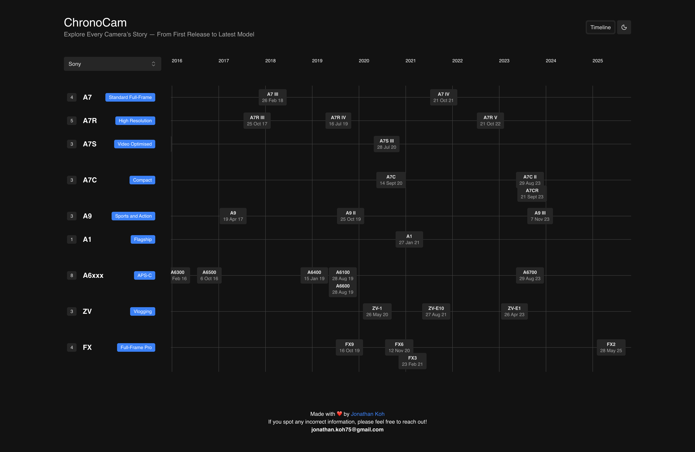

# Chrono Cam – Camera Market Timeline & Model Explorer


A web platform that displays camera brands, series, and models in interactive timelines, helping buyers and enthusiasts explore the evolution of the camera market.

## Why Chrono Cam?

Chrono Cam is built for **photography enthusiasts, collectors, and buyers** who want to:

-   Understand the evolution of camera models over time.
-   Compare brands and series at a glance.
-   Make informed buying decisions or simply explore the market history.

## Features

-   Interactive timelines for camera brands, series, and models.
-   Track market trends and model evolution visually.
-   Filter and explore cameras based on your interests.
-   Clean, responsive interface built with modern web technologies.

## Tech Stack

-   **Frontend:** Next.js, TypeScript, Tailwind CSS
-   **Backend:** Python, FastAPI

## Demo

  
_Interactive timelines showcasing camera brands and models._

## Getting Started

### Prerequisites

-   Node.js >= 18
-   Python >= 3.11
-   npm or yarn

### Installation

```bash
# Clone the repository
git clone https://github.com/JonKohJJ/chrono-cam.git
cd chrono-cam

# Install frontend dependencies
cd frontend
npm install

# Install backend dependencies
cd ../backend
pip install -r requirements.txt

# Run backend server
uvicorn main:app --reload

# Run frontend server (in a separate terminal)
cd ../frontend
npm run dev

# Open your browser at http://localhost:3000

```

## Contributing

Contributions are welcome! Follow these steps:

```bash
# Fork the project

# Create your feature branch
git checkout -b feature/NewFeature

# Commit your changes
git commit -m 'Add new feature'

# Push to the branch
git push origin feature/NewFeature

# Open a pull request
```
